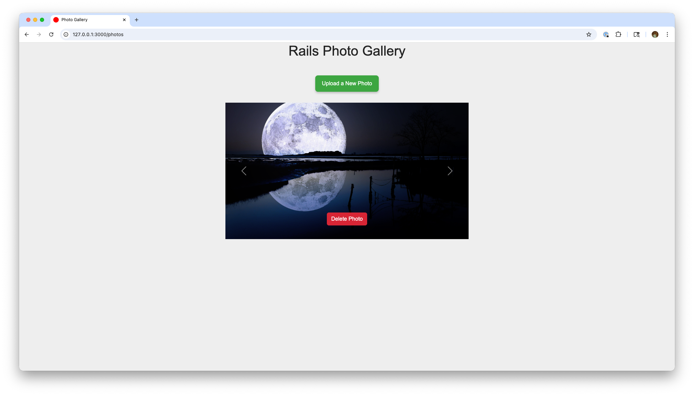

# Photo Gallery

This project was made to be merged into my Narratree blog site, allowing users to submit photos with their articles. It demonstrates using bootcamp components with a Ruby on Rails project.

## Screenshot



## Getting Started

### Prerequisites

- Ruby 3.x
- Rails 8.x
- SQLite3 (default) or another supported database

### Setup

1. Clone the repository:
   ```sh
   git clone https://github.com/atshaw1994/photo-gallery.git
   cd photo-gallery
   ```
2. Install dependencies:
   ```sh
   bundle install
   ```
3. Set up the database:
   ```sh
   bin/rails db:setup
   ```
4. Start the server:
   ```sh
   bin/rails server
   ```
5. Visit `http://localhost:3000` in your browser.

## Usage

- Upload photos using the green "Upload a New Photo" button.
- Scroll available photos using the left or right arrows.

## License

This project is licensed under the MIT License.
